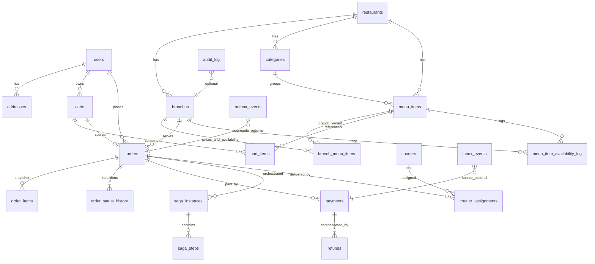

# ERD (MVP + Production Baseline)

## Notes
- `branch_menu_items` is the source of branch-specific price + stop-list status.
- `orders` and `order_items` keep immutable snapshots for historical correctness.
- `outbox_events` and `inbox_events` are mandatory for reliable async processing.
- `saga_instances`/`saga_steps` model orchestration and compensations.
